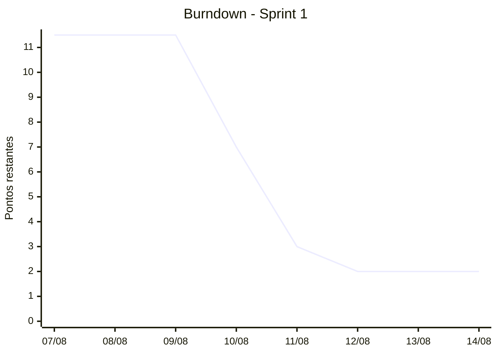
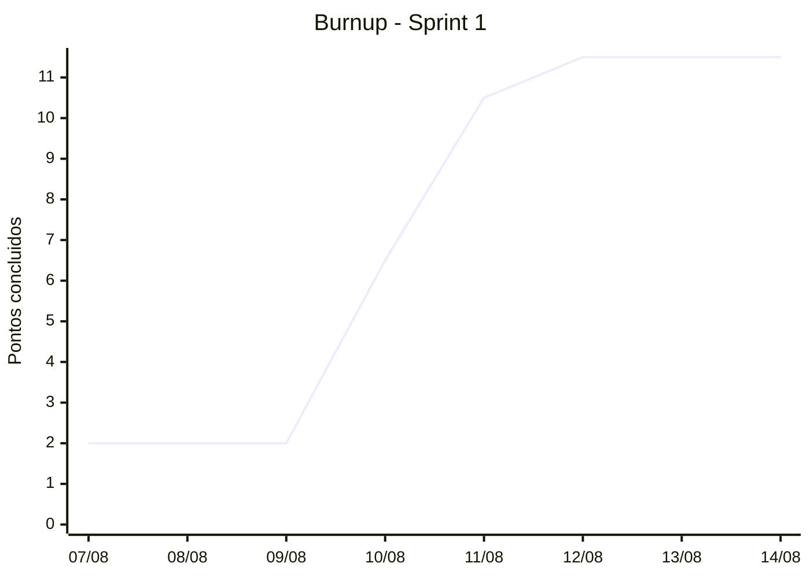

# Relatorio de Andamento

> Relatorio gerado por IA. Pode conter erros, omissoes ou interpretacoes imprecisas; revise antes de usar em reunioes ou decisoes.

Sprint: Sprint 1
Periodo: 07/08/26 ate 14/08/26
Gerado em: 13/08/26, 11:52:13 (2026-08-13T14:52:13.633Z)

## Tamanho da sprint

- Atividades: 11
- Pontos: 13.5
- Horas: 13.5
- Participantes: Andre, Gabriela, Gustavo, Isabela, Pedro, SmartIdea2026, Vitoria

## Resumo executivo

A Sprint 1 possui 11 atividades totalizando 13.5 pontos e horas. O time apresenta boa entrega na maioria das tarefas de pesquisa e processos, mas há uma atividade em andamento e outra concluída sem responsáveis definidos, além de itens inseridos no meio da sprint.

## Leitura da equipe

A equipe tem colaborado bem em tarefas em grupo (como na pesquisa de ferramentas e análise de vídeos), cobrindo múltiplos participantes. No entanto, há pendências de atribuição de responsáveis em algumas atividades.

## Riscos e atencoes
- Atividades criadas e executadas sem responsáveis designados (assignees)
- Itens sem pontuação (size) definida

## Atividades com problema
- #23 Registrar todos os itens com patrimonio da sala: Dificulta o rastreamento de quem realizou a entrega do patrimônio.
  https://github.com/SmartIdea2026/Projeto-Assistencia-estudantil-/issues/23
- #24 Criar uma logo para o SmartIdea: Item aberto na sprint sem dono definido, gerando risco de atraso.
  https://github.com/SmartIdea2026/Projeto-Assistencia-estudantil-/issues/24
- #5 Ideia de protótipo inicial: Falta de previsibilidade de tamanho e rastreabilidade de autoria.
  https://github.com/SmartIdea2026/Projeto-Assistencia-estudantil-/issues/5
- #8 ATA de reunião: Ausência de métricas de esforço e responsável registrado.
  https://github.com/SmartIdea2026/Projeto-Assistencia-estudantil-/issues/8

## Entraram no meio da sprint
- #22 Pesquisar e definir ferramenta de transcrição (criada em 10/08/26): Entrada no meio da sprint, mas já concluída com sucesso pela equipe.
  https://github.com/SmartIdea2026/Projeto-Assistencia-estudantil-/issues/22
- #23 Registrar todos os itens com patrimonio da sala (criada em 12/08/26): Demanda adicionada próximo ao fim da sprint sem responsável.
  https://github.com/SmartIdea2026/Projeto-Assistencia-estudantil-/issues/23
- #24 Criar uma logo para o SmartIdea (criada em 12/08/26): Demanda nova em andamento na reta final da sprint.
  https://github.com/SmartIdea2026/Projeto-Assistencia-estudantil-/issues/24

## Recomendacoes
- Atribuir um responsável claro para a atividade #24 em andamento para garantir sua conclusão antes do fim da sprint.
- Garantir que novas issues criadas durante a sprint já ingressem com estimativa de pontos (size) e responsáveis.

## Sinais para proxima alocacao
- Monitorar a carga de trabalho para evitar a entrada excessiva de escopo não planejado no meio do ciclo.

## Atividades e resultados

| # | Atividade | Link | Responsaveis | Raia | Pontos | Resultado |
|---|---|---|---|---|---:|---|
| 11 | Assistir os vídeos referente aos sistemas utilizados no IFMG e IFES-Vitória | https://github.com/SmartIdea2026/Projeto-Assistencia-estudantil-/issues/11 | Andre, Gustavo, Gabriela, Pedro, Vitoria, Isabela | Done | 2 | https://github.com/SmartIdea2026/Projeto-Assistencia-estudantil-/blob/main/Organizacao/Processo/Sistemas-SSAE.md |
| 12 | Criar o processo de registro de ata de reunião | https://github.com/SmartIdea2026/Projeto-Assistencia-estudantil-/issues/12 | Andre, Gabriela | Done | 2 | https://github.com/SmartIdea2026/Projeto-Assistencia-estudantil-/tree/main/Organizacao/Processo/Reuniao |
| 22 | Pesquisar e definir ferramenta de transcrição | https://github.com/SmartIdea2026/Projeto-Assistencia-estudantil-/issues/22 | Andre, Gustavo, Gabriela, Pedro, Vitoria, Isabela | Done | 2 | https://github.com/SmartIdea2026/Projeto-Assistencia-estudantil-/tree/main/Organizacao/Processo/Reuniao |
| 13 | Pesquisar ferramentas de prototipação. | https://github.com/SmartIdea2026/Projeto-Assistencia-estudantil-/issues/13 | Andre, Gustavo, Gabriela, Pedro, Vitoria, Isabela | Done | 2 | https://github.com/SmartIdea2026/Projeto-Assistencia-estudantil-/blob/main/FerramentasDePrototipa%C3%A7%C3%A3o.md |
| 23 | Registrar todos os itens com patrimonio da sala | https://github.com/SmartIdea2026/Projeto-Assistencia-estudantil-/issues/23 | sem responsavel | Done | 1 | Sem resultado explicito nos comentarios/dados carregados |
| 24 | Criar uma logo para o SmartIdea | https://github.com/SmartIdea2026/Projeto-Assistencia-estudantil-/issues/24 | sem responsavel | In progress | 2 | Em andamento |
| 17 | Definir o tempo de cada atividade e reponsabilidade. | https://github.com/SmartIdea2026/Projeto-Assistencia-estudantil-/issues/17 | SmartIdea2026 | Done | 0.5 | Sem resultado explicito nos comentarios/dados carregados |
| 15 | Criar um template de criação de issues no github. | https://github.com/SmartIdea2026/Projeto-Assistencia-estudantil-/issues/15 | Gustavo, Isabela | Done | 1 | Sem resultado explicito nos comentarios/dados carregados |
| 16 | Pesquisar como funcionar a parte de burndown do github. | https://github.com/SmartIdea2026/Projeto-Assistencia-estudantil-/issues/16 | Pedro, Vitoria | Done | 1 | Sem resultado explicito nos comentarios/dados carregados |
| 5 | Ideia de protótipo inicial | https://github.com/SmartIdea2026/Projeto-Assistencia-estudantil-/issues/5 | sem responsavel | Done | 0 | Sem resultado explicito nos comentarios/dados carregados |
| 8 | ATA de reunião | https://github.com/SmartIdea2026/Projeto-Assistencia-estudantil-/issues/8 | sem responsavel | Done | 0 | Sem resultado explicito nos comentarios/dados carregados |

## Detalhamento por responsavel

### Andre

- #11 Assistir os vídeos referente aos sistemas utilizados no IFMG e IFES-Vitória
  - Link: https://github.com/SmartIdea2026/Projeto-Assistencia-estudantil-/issues/11
  - Raia: Done
  - Pontos: 2
  - Estado: concluida
  - Resultado: https://github.com/SmartIdea2026/Projeto-Assistencia-estudantil-/blob/main/Organizacao/Processo/Sistemas-SSAE.md
  - Comentarios usados como evidencia: prajogabi em 12/08/26: https://github.com/SmartIdea2026/Projeto-Assistencia-estudantil-/blob/main/Organizacao/Processo/Sistemas-SSAE.md
- #12 Criar o processo de registro de ata de reunião
  - Link: https://github.com/SmartIdea2026/Projeto-Assistencia-estudantil-/issues/12
  - Raia: Done
  - Pontos: 2
  - Estado: concluida
  - Resultado: https://github.com/SmartIdea2026/Projeto-Assistencia-estudantil-/tree/main/Organizacao/Processo/Reuniao
  - Comentarios usados como evidencia: prajogabi em 12/08/26: https://github.com/SmartIdea2026/Projeto-Assistencia-estudantil-/tree/main/Organizacao/Processo/Reuniao
- #22 Pesquisar e definir ferramenta de transcrição
  - Link: https://github.com/SmartIdea2026/Projeto-Assistencia-estudantil-/issues/22
  - Raia: Done
  - Pontos: 2
  - Estado: concluida
  - Resultado: https://github.com/SmartIdea2026/Projeto-Assistencia-estudantil-/tree/main/Organizacao/Processo/Reuniao
  - Comentarios usados como evidencia: prajogabi em 12/08/26: https://github.com/SmartIdea2026/Projeto-Assistencia-estudantil-/tree/main/Organizacao/Processo/Reuniao
- #13 Pesquisar ferramentas de prototipação.
  - Link: https://github.com/SmartIdea2026/Projeto-Assistencia-estudantil-/issues/13
  - Raia: Done
  - Pontos: 2
  - Estado: concluida
  - Resultado: https://github.com/SmartIdea2026/Projeto-Assistencia-estudantil-/blob/main/FerramentasDePrototipa%C3%A7%C3%A3o.md
  - Comentarios usados como evidencia: prajogabi em 12/08/26: https://github.com/SmartIdea2026/Projeto-Assistencia-estudantil-/blob/main/FerramentasDePrototipa%C3%A7%C3%A3o.md

### Gustavo

- #11 Assistir os vídeos referente aos sistemas utilizados no IFMG e IFES-Vitória
  - Link: https://github.com/SmartIdea2026/Projeto-Assistencia-estudantil-/issues/11
  - Raia: Done
  - Pontos: 2
  - Estado: concluida
  - Resultado: https://github.com/SmartIdea2026/Projeto-Assistencia-estudantil-/blob/main/Organizacao/Processo/Sistemas-SSAE.md
  - Comentarios usados como evidencia: prajogabi em 12/08/26: https://github.com/SmartIdea2026/Projeto-Assistencia-estudantil-/blob/main/Organizacao/Processo/Sistemas-SSAE.md
- #22 Pesquisar e definir ferramenta de transcrição
  - Link: https://github.com/SmartIdea2026/Projeto-Assistencia-estudantil-/issues/22
  - Raia: Done
  - Pontos: 2
  - Estado: concluida
  - Resultado: https://github.com/SmartIdea2026/Projeto-Assistencia-estudantil-/tree/main/Organizacao/Processo/Reuniao
  - Comentarios usados como evidencia: prajogabi em 12/08/26: https://github.com/SmartIdea2026/Projeto-Assistencia-estudantil-/tree/main/Organizacao/Processo/Reuniao
- #13 Pesquisar ferramentas de prototipação.
  - Link: https://github.com/SmartIdea2026/Projeto-Assistencia-estudantil-/issues/13
  - Raia: Done
  - Pontos: 2
  - Estado: concluida
  - Resultado: https://github.com/SmartIdea2026/Projeto-Assistencia-estudantil-/blob/main/FerramentasDePrototipa%C3%A7%C3%A3o.md
  - Comentarios usados como evidencia: prajogabi em 12/08/26: https://github.com/SmartIdea2026/Projeto-Assistencia-estudantil-/blob/main/FerramentasDePrototipa%C3%A7%C3%A3o.md
- #15 Criar um template de criação de issues no github.
  - Link: https://github.com/SmartIdea2026/Projeto-Assistencia-estudantil-/issues/15
  - Raia: Done
  - Pontos: 1
  - Estado: concluida
  - Resultado: Sem resultado explicito nos comentarios/dados carregados
  - Comentarios usados como evidencia: nenhum comentario de resultado carregado

### Gabriela

- #11 Assistir os vídeos referente aos sistemas utilizados no IFMG e IFES-Vitória
  - Link: https://github.com/SmartIdea2026/Projeto-Assistencia-estudantil-/issues/11
  - Raia: Done
  - Pontos: 2
  - Estado: concluida
  - Resultado: https://github.com/SmartIdea2026/Projeto-Assistencia-estudantil-/blob/main/Organizacao/Processo/Sistemas-SSAE.md
  - Comentarios usados como evidencia: prajogabi em 12/08/26: https://github.com/SmartIdea2026/Projeto-Assistencia-estudantil-/blob/main/Organizacao/Processo/Sistemas-SSAE.md
- #12 Criar o processo de registro de ata de reunião
  - Link: https://github.com/SmartIdea2026/Projeto-Assistencia-estudantil-/issues/12
  - Raia: Done
  - Pontos: 2
  - Estado: concluida
  - Resultado: https://github.com/SmartIdea2026/Projeto-Assistencia-estudantil-/tree/main/Organizacao/Processo/Reuniao
  - Comentarios usados como evidencia: prajogabi em 12/08/26: https://github.com/SmartIdea2026/Projeto-Assistencia-estudantil-/tree/main/Organizacao/Processo/Reuniao
- #22 Pesquisar e definir ferramenta de transcrição
  - Link: https://github.com/SmartIdea2026/Projeto-Assistencia-estudantil-/issues/22
  - Raia: Done
  - Pontos: 2
  - Estado: concluida
  - Resultado: https://github.com/SmartIdea2026/Projeto-Assistencia-estudantil-/tree/main/Organizacao/Processo/Reuniao
  - Comentarios usados como evidencia: prajogabi em 12/08/26: https://github.com/SmartIdea2026/Projeto-Assistencia-estudantil-/tree/main/Organizacao/Processo/Reuniao
- #13 Pesquisar ferramentas de prototipação.
  - Link: https://github.com/SmartIdea2026/Projeto-Assistencia-estudantil-/issues/13
  - Raia: Done
  - Pontos: 2
  - Estado: concluida
  - Resultado: https://github.com/SmartIdea2026/Projeto-Assistencia-estudantil-/blob/main/FerramentasDePrototipa%C3%A7%C3%A3o.md
  - Comentarios usados como evidencia: prajogabi em 12/08/26: https://github.com/SmartIdea2026/Projeto-Assistencia-estudantil-/blob/main/FerramentasDePrototipa%C3%A7%C3%A3o.md

### Pedro

- #11 Assistir os vídeos referente aos sistemas utilizados no IFMG e IFES-Vitória
  - Link: https://github.com/SmartIdea2026/Projeto-Assistencia-estudantil-/issues/11
  - Raia: Done
  - Pontos: 2
  - Estado: concluida
  - Resultado: https://github.com/SmartIdea2026/Projeto-Assistencia-estudantil-/blob/main/Organizacao/Processo/Sistemas-SSAE.md
  - Comentarios usados como evidencia: prajogabi em 12/08/26: https://github.com/SmartIdea2026/Projeto-Assistencia-estudantil-/blob/main/Organizacao/Processo/Sistemas-SSAE.md
- #22 Pesquisar e definir ferramenta de transcrição
  - Link: https://github.com/SmartIdea2026/Projeto-Assistencia-estudantil-/issues/22
  - Raia: Done
  - Pontos: 2
  - Estado: concluida
  - Resultado: https://github.com/SmartIdea2026/Projeto-Assistencia-estudantil-/tree/main/Organizacao/Processo/Reuniao
  - Comentarios usados como evidencia: prajogabi em 12/08/26: https://github.com/SmartIdea2026/Projeto-Assistencia-estudantil-/tree/main/Organizacao/Processo/Reuniao
- #13 Pesquisar ferramentas de prototipação.
  - Link: https://github.com/SmartIdea2026/Projeto-Assistencia-estudantil-/issues/13
  - Raia: Done
  - Pontos: 2
  - Estado: concluida
  - Resultado: https://github.com/SmartIdea2026/Projeto-Assistencia-estudantil-/blob/main/FerramentasDePrototipa%C3%A7%C3%A3o.md
  - Comentarios usados como evidencia: prajogabi em 12/08/26: https://github.com/SmartIdea2026/Projeto-Assistencia-estudantil-/blob/main/FerramentasDePrototipa%C3%A7%C3%A3o.md
- #16 Pesquisar como funcionar a parte de burndown do github.
  - Link: https://github.com/SmartIdea2026/Projeto-Assistencia-estudantil-/issues/16
  - Raia: Done
  - Pontos: 1
  - Estado: concluida
  - Resultado: Sem resultado explicito nos comentarios/dados carregados
  - Comentarios usados como evidencia: nenhum comentario de resultado carregado

### Vitoria

- #11 Assistir os vídeos referente aos sistemas utilizados no IFMG e IFES-Vitória
  - Link: https://github.com/SmartIdea2026/Projeto-Assistencia-estudantil-/issues/11
  - Raia: Done
  - Pontos: 2
  - Estado: concluida
  - Resultado: https://github.com/SmartIdea2026/Projeto-Assistencia-estudantil-/blob/main/Organizacao/Processo/Sistemas-SSAE.md
  - Comentarios usados como evidencia: prajogabi em 12/08/26: https://github.com/SmartIdea2026/Projeto-Assistencia-estudantil-/blob/main/Organizacao/Processo/Sistemas-SSAE.md
- #22 Pesquisar e definir ferramenta de transcrição
  - Link: https://github.com/SmartIdea2026/Projeto-Assistencia-estudantil-/issues/22
  - Raia: Done
  - Pontos: 2
  - Estado: concluida
  - Resultado: https://github.com/SmartIdea2026/Projeto-Assistencia-estudantil-/tree/main/Organizacao/Processo/Reuniao
  - Comentarios usados como evidencia: prajogabi em 12/08/26: https://github.com/SmartIdea2026/Projeto-Assistencia-estudantil-/tree/main/Organizacao/Processo/Reuniao
- #13 Pesquisar ferramentas de prototipação.
  - Link: https://github.com/SmartIdea2026/Projeto-Assistencia-estudantil-/issues/13
  - Raia: Done
  - Pontos: 2
  - Estado: concluida
  - Resultado: https://github.com/SmartIdea2026/Projeto-Assistencia-estudantil-/blob/main/FerramentasDePrototipa%C3%A7%C3%A3o.md
  - Comentarios usados como evidencia: prajogabi em 12/08/26: https://github.com/SmartIdea2026/Projeto-Assistencia-estudantil-/blob/main/FerramentasDePrototipa%C3%A7%C3%A3o.md
- #16 Pesquisar como funcionar a parte de burndown do github.
  - Link: https://github.com/SmartIdea2026/Projeto-Assistencia-estudantil-/issues/16
  - Raia: Done
  - Pontos: 1
  - Estado: concluida
  - Resultado: Sem resultado explicito nos comentarios/dados carregados
  - Comentarios usados como evidencia: nenhum comentario de resultado carregado

### Isabela

- #11 Assistir os vídeos referente aos sistemas utilizados no IFMG e IFES-Vitória
  - Link: https://github.com/SmartIdea2026/Projeto-Assistencia-estudantil-/issues/11
  - Raia: Done
  - Pontos: 2
  - Estado: concluida
  - Resultado: https://github.com/SmartIdea2026/Projeto-Assistencia-estudantil-/blob/main/Organizacao/Processo/Sistemas-SSAE.md
  - Comentarios usados como evidencia: prajogabi em 12/08/26: https://github.com/SmartIdea2026/Projeto-Assistencia-estudantil-/blob/main/Organizacao/Processo/Sistemas-SSAE.md
- #22 Pesquisar e definir ferramenta de transcrição
  - Link: https://github.com/SmartIdea2026/Projeto-Assistencia-estudantil-/issues/22
  - Raia: Done
  - Pontos: 2
  - Estado: concluida
  - Resultado: https://github.com/SmartIdea2026/Projeto-Assistencia-estudantil-/tree/main/Organizacao/Processo/Reuniao
  - Comentarios usados como evidencia: prajogabi em 12/08/26: https://github.com/SmartIdea2026/Projeto-Assistencia-estudantil-/tree/main/Organizacao/Processo/Reuniao
- #13 Pesquisar ferramentas de prototipação.
  - Link: https://github.com/SmartIdea2026/Projeto-Assistencia-estudantil-/issues/13
  - Raia: Done
  - Pontos: 2
  - Estado: concluida
  - Resultado: https://github.com/SmartIdea2026/Projeto-Assistencia-estudantil-/blob/main/FerramentasDePrototipa%C3%A7%C3%A3o.md
  - Comentarios usados como evidencia: prajogabi em 12/08/26: https://github.com/SmartIdea2026/Projeto-Assistencia-estudantil-/blob/main/FerramentasDePrototipa%C3%A7%C3%A3o.md
- #15 Criar um template de criação de issues no github.
  - Link: https://github.com/SmartIdea2026/Projeto-Assistencia-estudantil-/issues/15
  - Raia: Done
  - Pontos: 1
  - Estado: concluida
  - Resultado: Sem resultado explicito nos comentarios/dados carregados
  - Comentarios usados como evidencia: nenhum comentario de resultado carregado

### Sem responsavel

- #23 Registrar todos os itens com patrimonio da sala
  - Link: https://github.com/SmartIdea2026/Projeto-Assistencia-estudantil-/issues/23
  - Raia: Done
  - Pontos: 1
  - Estado: concluida
  - Resultado: Sem resultado explicito nos comentarios/dados carregados
  - Comentarios usados como evidencia: nenhum comentario de resultado carregado
- #24 Criar uma logo para o SmartIdea
  - Link: https://github.com/SmartIdea2026/Projeto-Assistencia-estudantil-/issues/24
  - Raia: In progress
  - Pontos: 2
  - Estado: em andamento
  - Resultado: Em andamento
  - Comentarios usados como evidencia: nenhum comentario de resultado carregado
- #5 Ideia de protótipo inicial
  - Link: https://github.com/SmartIdea2026/Projeto-Assistencia-estudantil-/issues/5
  - Raia: Done
  - Pontos: 0
  - Estado: concluida
  - Resultado: Sem resultado explicito nos comentarios/dados carregados
  - Comentarios usados como evidencia: nenhum comentario de resultado carregado
- #8 ATA de reunião
  - Link: https://github.com/SmartIdea2026/Projeto-Assistencia-estudantil-/issues/8
  - Raia: Done
  - Pontos: 0
  - Estado: concluida
  - Resultado: Sem resultado explicito nos comentarios/dados carregados
  - Comentarios usados como evidencia: nenhum comentario de resultado carregado

### SmartIdea2026

- #17 Definir o tempo de cada atividade e reponsabilidade.
  - Link: https://github.com/SmartIdea2026/Projeto-Assistencia-estudantil-/issues/17
  - Raia: Done
  - Pontos: 0.5
  - Estado: concluida
  - Resultado: Sem resultado explicito nos comentarios/dados carregados
  - Comentarios usados como evidencia: nenhum comentario de resultado carregado

## Pessoas
- Andre: Participou ativamente das tarefas de imersão, processos de reunião e pesquisa de ferramentas.
- Gustavo: Atuou em pesquisas de ferramentas, definição de processos e criação de templates.
- Gabriela: Envolvida na definição de processos de reunião, templates e pesquisas iniciais.
- Pedro: Participou de pesquisas sobre burndown, ferramentas e análise de vídeos.
- Vitoria: Atuou em conjunto com o time em pesquisas de ferramentas e entendimento de métricas.
- Isabela: Contribuiu em pesquisas, templates do GitHub e análise de sistemas.
- SmartIdea2026: Consta como autor/responsável em tarefas de definição de tempos e registro patrimonial.

## Burndown

| Data | Pontos restantes |
|---|---:|
| 07/08 | 11.5 |
| 08/08 | 11.5 |
| 09/08 | 11.5 |
| 10/08 | 7 |
| 11/08 | 3 |
| 12/08 | 2 |
| 13/08 | 2 |
| 14/08 | 2 |

## Burnup

| Data | Pontos concluidos |
|---|---:|
| 07/08 | 2 |
| 08/08 | 2 |
| 09/08 | 2 |
| 10/08 | 6.5 |
| 11/08 | 10.5 |
| 12/08 | 11.5 |
| 13/08 | 11.5 |
| 14/08 | 11.5 |
