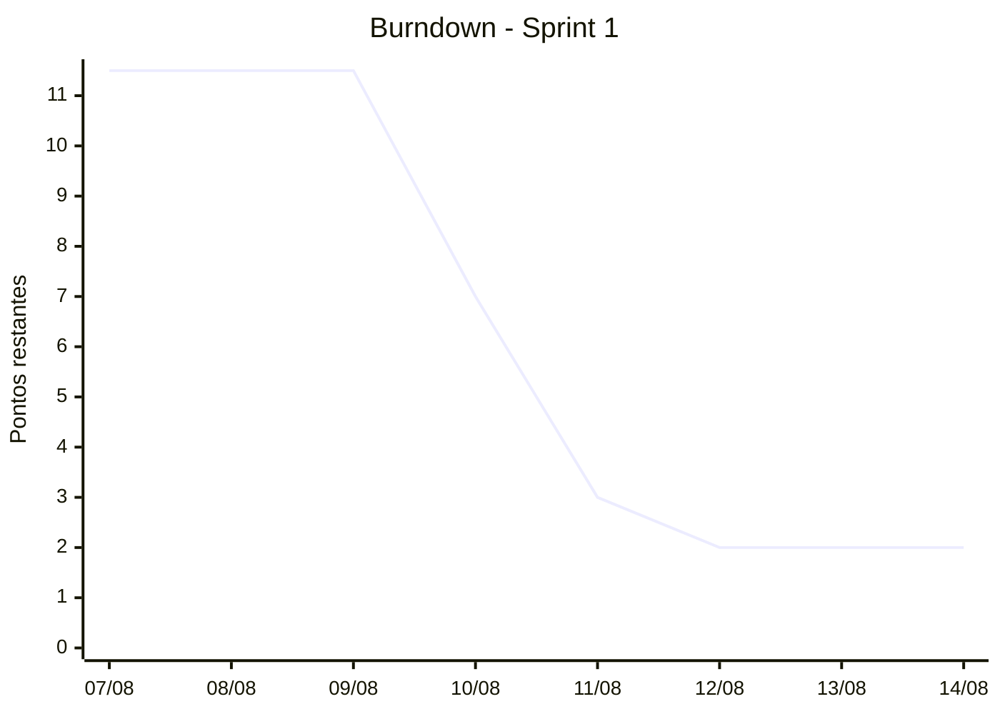
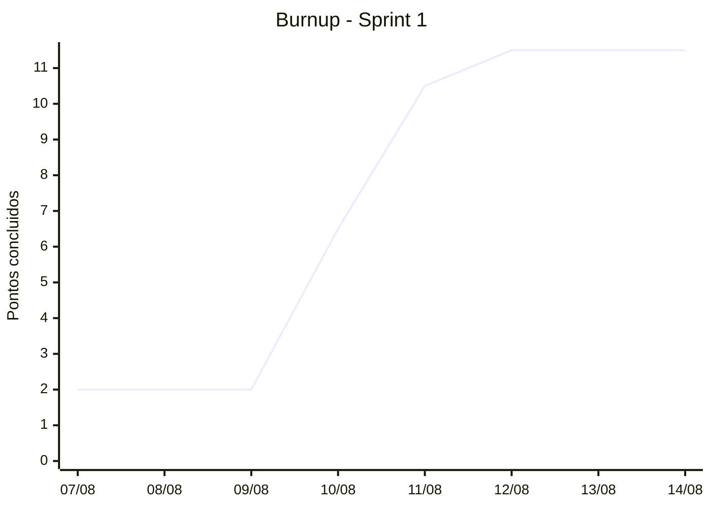

# Relatorio de Andamento

> Relatorio gerado por IA. Pode conter erros, omissoes ou interpretacoes imprecisas; revise antes de usar em reunioes ou decisoes.

Sprint: Sprint 1
Periodo: 07/08/26 ate 14/08/26
Gerado em: 13/08/26, 12:03:32 (2026-08-13T15:03:32.974Z)

## Tamanho da sprint

- Atividades: 11
- Pontos: 13.5
- Horas: 13.5
- Participantes: Andre, Gabriela, Gustavo, Isabela, Pedro, SmartIdea2026, Vitoria

## Resumo executivo

A Sprint 1 do projeto Smart Idea está em andamento (07/08/2026 a 14/08/2026) contando com 11 atividades, totalizando 13.5 pontos e 13.5 horas distribuídas entre 7 participantes. A maioria das tarefas foi concluída, restando apenas uma atividade aberta na raia 'In progress' que carece de responsável.

## Leitura da equipe

A equipe demonstrou forte engajamento em atividades de pesquisa, documentação e alinhamento de processos (como atas, ferramentas de transcrição e prototipação). No entanto, há falhas recorrentes no preenchimento de metadados das issues, como ausência de responsáveis e de estimativas de pontos.

## Riscos e atencoes
- Atividades sem responsável atribuído (#24 está em andamento sem dono definido)
- Issues criadas sem definição de tamanho ou pontos (#5 e #8)
- Falta de rastreabilidade de responsáveis em tarefas já concluídas (#23, #5, #8)

## Atividades com problema
- #23 Registrar todos os itens com patrimonio da sala: Dificulta a atribuição de mérito e rastreabilidade da execução, mesmo estando na raia Done.
  https://github.com/SmartIdea2026/Projeto-Assistencia-estudantil-/issues/23
- #24 Criar uma logo para o SmartIdea: Uma atividade em andamento na raia In progress sem responsável oficial pode gerar ociosidade ou duplicidade de esforço.
  https://github.com/SmartIdea2026/Projeto-Assistencia-estudantil-/issues/24
- #5 Ideia de protótipo inicial: Falta de dados precisos de estimativa e alocação, prejudicando a métrica de capacidade.
  https://github.com/SmartIdea2026/Projeto-Assistencia-estudantil-/issues/5
- #8 ATA de reunião: Ausência de responsável e estimativa em issue finalizada.
  https://github.com/SmartIdea2026/Projeto-Assistencia-estudantil-/issues/8

## Entraram no meio da sprint
- #22 Pesquisar e definir ferramenta de transcrição (criada em 10/08/26): Entrada bem-sucedida durante a sprint, executada em conjunto e já concluída.
  https://github.com/SmartIdea2026/Projeto-Assistencia-estudantil-/issues/22
- #23 Registrar todos os itens com patrimonio da sala (criada em 12/08/26): Entrada tardia na sprint, finalizada rapidamente, mas sem responsável formal.
  https://github.com/SmartIdea2026/Projeto-Assistencia-estudantil-/issues/23
- #24 Criar uma logo para o SmartIdea (criada em 12/08/26): Demanda iniciada no meio da sprint que segue em andamento sem responsável atribuído.
  https://github.com/SmartIdea2026/Projeto-Assistencia-estudantil-/issues/24

## Recomendacoes
- Designar imediatamente um responsável para a atividade #24 que está em andamento.
- Orientar a equipe a sempre preencher os campos de 'assignees' e 'size' ao criar ou puxar novas issues.
- Garantir que a cultura de trabalho em dupla seja refletida corretamente nas atribuições do GitHub.

## Sinais para proxima alocacao
- Incentivar melhor distribuição formal de pares nas tarefas para evitar issues sem responsáveis.

## Atividades e resultados

| # | Atividade | Link | Responsaveis | Raia | Pontos | Resultado |
|---|---|---|---|---|---:|---|
| 11 | Assistir os vídeos referente aos sistemas utilizados no IFMG e IFES-Vitória | https://github.com/SmartIdea2026/Projeto-Assistencia-estudantil-/issues/11 | Andre, Gustavo, Gabriela, Pedro, Vitoria, Isabela | Done | 2 | https://github.com/SmartIdea2026/Projeto-Assistencia-estudantil-/blob/main/Organizacao/Processo/Sistemas-SSAE.md |
| 12 | Criar o processo de registro de ata de reunião | https://github.com/SmartIdea2026/Projeto-Assistencia-estudantil-/issues/12 | Andre, Gabriela | Done | 2 | https://github.com/SmartIdea2026/Projeto-Assistencia-estudantil-/tree/main/Organizacao/Processo/Reuniao |
| 22 | Pesquisar e definir ferramenta de transcrição | https://github.com/SmartIdea2026/Projeto-Assistencia-estudantil-/issues/22 | Andre, Gustavo, Gabriela, Pedro, Vitoria, Isabela | Done | 2 | https://github.com/SmartIdea2026/Projeto-Assistencia-estudantil-/tree/main/Organizacao/Processo/Reuniao |
| 13 | Pesquisar ferramentas de prototipação. | https://github.com/SmartIdea2026/Projeto-Assistencia-estudantil-/issues/13 | Andre, Gustavo, Gabriela, Pedro, Vitoria, Isabela | Done | 2 | https://github.com/SmartIdea2026/Projeto-Assistencia-estudantil-/blob/main/FerramentasDePrototipa%C3%A7%C3%A3o.md |
| 23 | Registrar todos os itens com patrimonio da sala | https://github.com/SmartIdea2026/Projeto-Assistencia-estudantil-/issues/23 | sem responsavel | Done | 1 | Sem resultado explicito nos comentarios/dados carregados |
| 24 | Criar uma logo para o SmartIdea | https://github.com/SmartIdea2026/Projeto-Assistencia-estudantil-/issues/24 | sem responsavel | In progress | 2 | Em andamento |
| 17 | Definir o tempo de cada atividade e reponsabilidade. | https://github.com/SmartIdea2026/Projeto-Assistencia-estudantil-/issues/17 | SmartIdea2026 | Done | 0.5 | Sem resultado explicito nos comentarios/dados carregados |
| 15 | Criar um template de criação de issues no github. | https://github.com/SmartIdea2026/Projeto-Assistencia-estudantil-/issues/15 | Gustavo, Isabela | Done | 1 | Sem resultado explicito nos comentarios/dados carregados |
| 16 | Pesquisar como funcionar a parte de burndown do github. | https://github.com/SmartIdea2026/Projeto-Assistencia-estudantil-/issues/16 | Pedro, Vitoria | Done | 1 | Sem resultado explicito nos comentarios/dados carregados |
| 5 | Ideia de protótipo inicial | https://github.com/SmartIdea2026/Projeto-Assistencia-estudantil-/issues/5 | sem responsavel | Done | 0 | Sem resultado explicito nos comentarios/dados carregados |
| 8 | ATA de reunião | https://github.com/SmartIdea2026/Projeto-Assistencia-estudantil-/issues/8 | sem responsavel | Done | 0 | Sem resultado explicito nos comentarios/dados carregados |

## Detalhamento por responsavel

### Andre

- #11 Assistir os vídeos referente aos sistemas utilizados no IFMG e IFES-Vitória
  - Link: https://github.com/SmartIdea2026/Projeto-Assistencia-estudantil-/issues/11
  - Raia: Done
  - Pontos: 2
  - Estado: concluida
  - Resultado: https://github.com/SmartIdea2026/Projeto-Assistencia-estudantil-/blob/main/Organizacao/Processo/Sistemas-SSAE.md
  - Comentarios usados como evidencia: prajogabi em 12/08/26: https://github.com/SmartIdea2026/Projeto-Assistencia-estudantil-/blob/main/Organizacao/Processo/Sistemas-SSAE.md
- #12 Criar o processo de registro de ata de reunião
  - Link: https://github.com/SmartIdea2026/Projeto-Assistencia-estudantil-/issues/12
  - Raia: Done
  - Pontos: 2
  - Estado: concluida
  - Resultado: https://github.com/SmartIdea2026/Projeto-Assistencia-estudantil-/tree/main/Organizacao/Processo/Reuniao
  - Comentarios usados como evidencia: prajogabi em 12/08/26: https://github.com/SmartIdea2026/Projeto-Assistencia-estudantil-/tree/main/Organizacao/Processo/Reuniao
- #22 Pesquisar e definir ferramenta de transcrição
  - Link: https://github.com/SmartIdea2026/Projeto-Assistencia-estudantil-/issues/22
  - Raia: Done
  - Pontos: 2
  - Estado: concluida
  - Resultado: https://github.com/SmartIdea2026/Projeto-Assistencia-estudantil-/tree/main/Organizacao/Processo/Reuniao
  - Comentarios usados como evidencia: prajogabi em 12/08/26: https://github.com/SmartIdea2026/Projeto-Assistencia-estudantil-/tree/main/Organizacao/Processo/Reuniao
- #13 Pesquisar ferramentas de prototipação.
  - Link: https://github.com/SmartIdea2026/Projeto-Assistencia-estudantil-/issues/13
  - Raia: Done
  - Pontos: 2
  - Estado: concluida
  - Resultado: https://github.com/SmartIdea2026/Projeto-Assistencia-estudantil-/blob/main/FerramentasDePrototipa%C3%A7%C3%A3o.md
  - Comentarios usados como evidencia: prajogabi em 12/08/26: https://github.com/SmartIdea2026/Projeto-Assistencia-estudantil-/blob/main/FerramentasDePrototipa%C3%A7%C3%A3o.md

### Gustavo

- #11 Assistir os vídeos referente aos sistemas utilizados no IFMG e IFES-Vitória
  - Link: https://github.com/SmartIdea2026/Projeto-Assistencia-estudantil-/issues/11
  - Raia: Done
  - Pontos: 2
  - Estado: concluida
  - Resultado: https://github.com/SmartIdea2026/Projeto-Assistencia-estudantil-/blob/main/Organizacao/Processo/Sistemas-SSAE.md
  - Comentarios usados como evidencia: prajogabi em 12/08/26: https://github.com/SmartIdea2026/Projeto-Assistencia-estudantil-/blob/main/Organizacao/Processo/Sistemas-SSAE.md
- #22 Pesquisar e definir ferramenta de transcrição
  - Link: https://github.com/SmartIdea2026/Projeto-Assistencia-estudantil-/issues/22
  - Raia: Done
  - Pontos: 2
  - Estado: concluida
  - Resultado: https://github.com/SmartIdea2026/Projeto-Assistencia-estudantil-/tree/main/Organizacao/Processo/Reuniao
  - Comentarios usados como evidencia: prajogabi em 12/08/26: https://github.com/SmartIdea2026/Projeto-Assistencia-estudantil-/tree/main/Organizacao/Processo/Reuniao
- #13 Pesquisar ferramentas de prototipação.
  - Link: https://github.com/SmartIdea2026/Projeto-Assistencia-estudantil-/issues/13
  - Raia: Done
  - Pontos: 2
  - Estado: concluida
  - Resultado: https://github.com/SmartIdea2026/Projeto-Assistencia-estudantil-/blob/main/FerramentasDePrototipa%C3%A7%C3%A3o.md
  - Comentarios usados como evidencia: prajogabi em 12/08/26: https://github.com/SmartIdea2026/Projeto-Assistencia-estudantil-/blob/main/FerramentasDePrototipa%C3%A7%C3%A3o.md
- #15 Criar um template de criação de issues no github.
  - Link: https://github.com/SmartIdea2026/Projeto-Assistencia-estudantil-/issues/15
  - Raia: Done
  - Pontos: 1
  - Estado: concluida
  - Resultado: Sem resultado explicito nos comentarios/dados carregados
  - Comentarios usados como evidencia: nenhum comentario de resultado carregado

### Gabriela

- #11 Assistir os vídeos referente aos sistemas utilizados no IFMG e IFES-Vitória
  - Link: https://github.com/SmartIdea2026/Projeto-Assistencia-estudantil-/issues/11
  - Raia: Done
  - Pontos: 2
  - Estado: concluida
  - Resultado: https://github.com/SmartIdea2026/Projeto-Assistencia-estudantil-/blob/main/Organizacao/Processo/Sistemas-SSAE.md
  - Comentarios usados como evidencia: prajogabi em 12/08/26: https://github.com/SmartIdea2026/Projeto-Assistencia-estudantil-/blob/main/Organizacao/Processo/Sistemas-SSAE.md
- #12 Criar o processo de registro de ata de reunião
  - Link: https://github.com/SmartIdea2026/Projeto-Assistencia-estudantil-/issues/12
  - Raia: Done
  - Pontos: 2
  - Estado: concluida
  - Resultado: https://github.com/SmartIdea2026/Projeto-Assistencia-estudantil-/tree/main/Organizacao/Processo/Reuniao
  - Comentarios usados como evidencia: prajogabi em 12/08/26: https://github.com/SmartIdea2026/Projeto-Assistencia-estudantil-/tree/main/Organizacao/Processo/Reuniao
- #22 Pesquisar e definir ferramenta de transcrição
  - Link: https://github.com/SmartIdea2026/Projeto-Assistencia-estudantil-/issues/22
  - Raia: Done
  - Pontos: 2
  - Estado: concluida
  - Resultado: https://github.com/SmartIdea2026/Projeto-Assistencia-estudantil-/tree/main/Organizacao/Processo/Reuniao
  - Comentarios usados como evidencia: prajogabi em 12/08/26: https://github.com/SmartIdea2026/Projeto-Assistencia-estudantil-/tree/main/Organizacao/Processo/Reuniao
- #13 Pesquisar ferramentas de prototipação.
  - Link: https://github.com/SmartIdea2026/Projeto-Assistencia-estudantil-/issues/13
  - Raia: Done
  - Pontos: 2
  - Estado: concluida
  - Resultado: https://github.com/SmartIdea2026/Projeto-Assistencia-estudantil-/blob/main/FerramentasDePrototipa%C3%A7%C3%A3o.md
  - Comentarios usados como evidencia: prajogabi em 12/08/26: https://github.com/SmartIdea2026/Projeto-Assistencia-estudantil-/blob/main/FerramentasDePrototipa%C3%A7%C3%A3o.md

### Pedro

- #11 Assistir os vídeos referente aos sistemas utilizados no IFMG e IFES-Vitória
  - Link: https://github.com/SmartIdea2026/Projeto-Assistencia-estudantil-/issues/11
  - Raia: Done
  - Pontos: 2
  - Estado: concluida
  - Resultado: https://github.com/SmartIdea2026/Projeto-Assistencia-estudantil-/blob/main/Organizacao/Processo/Sistemas-SSAE.md
  - Comentarios usados como evidencia: prajogabi em 12/08/26: https://github.com/SmartIdea2026/Projeto-Assistencia-estudantil-/blob/main/Organizacao/Processo/Sistemas-SSAE.md
- #22 Pesquisar e definir ferramenta de transcrição
  - Link: https://github.com/SmartIdea2026/Projeto-Assistencia-estudantil-/issues/22
  - Raia: Done
  - Pontos: 2
  - Estado: concluida
  - Resultado: https://github.com/SmartIdea2026/Projeto-Assistencia-estudantil-/tree/main/Organizacao/Processo/Reuniao
  - Comentarios usados como evidencia: prajogabi em 12/08/26: https://github.com/SmartIdea2026/Projeto-Assistencia-estudantil-/tree/main/Organizacao/Processo/Reuniao
- #13 Pesquisar ferramentas de prototipação.
  - Link: https://github.com/SmartIdea2026/Projeto-Assistencia-estudantil-/issues/13
  - Raia: Done
  - Pontos: 2
  - Estado: concluida
  - Resultado: https://github.com/SmartIdea2026/Projeto-Assistencia-estudantil-/blob/main/FerramentasDePrototipa%C3%A7%C3%A3o.md
  - Comentarios usados como evidencia: prajogabi em 12/08/26: https://github.com/SmartIdea2026/Projeto-Assistencia-estudantil-/blob/main/FerramentasDePrototipa%C3%A7%C3%A3o.md
- #16 Pesquisar como funcionar a parte de burndown do github.
  - Link: https://github.com/SmartIdea2026/Projeto-Assistencia-estudantil-/issues/16
  - Raia: Done
  - Pontos: 1
  - Estado: concluida
  - Resultado: Sem resultado explicito nos comentarios/dados carregados
  - Comentarios usados como evidencia: nenhum comentario de resultado carregado

### Vitoria

- #11 Assistir os vídeos referente aos sistemas utilizados no IFMG e IFES-Vitória
  - Link: https://github.com/SmartIdea2026/Projeto-Assistencia-estudantil-/issues/11
  - Raia: Done
  - Pontos: 2
  - Estado: concluida
  - Resultado: https://github.com/SmartIdea2026/Projeto-Assistencia-estudantil-/blob/main/Organizacao/Processo/Sistemas-SSAE.md
  - Comentarios usados como evidencia: prajogabi em 12/08/26: https://github.com/SmartIdea2026/Projeto-Assistencia-estudantil-/blob/main/Organizacao/Processo/Sistemas-SSAE.md
- #22 Pesquisar e definir ferramenta de transcrição
  - Link: https://github.com/SmartIdea2026/Projeto-Assistencia-estudantil-/issues/22
  - Raia: Done
  - Pontos: 2
  - Estado: concluida
  - Resultado: https://github.com/SmartIdea2026/Projeto-Assistencia-estudantil-/tree/main/Organizacao/Processo/Reuniao
  - Comentarios usados como evidencia: prajogabi em 12/08/26: https://github.com/SmartIdea2026/Projeto-Assistencia-estudantil-/tree/main/Organizacao/Processo/Reuniao
- #13 Pesquisar ferramentas de prototipação.
  - Link: https://github.com/SmartIdea2026/Projeto-Assistencia-estudantil-/issues/13
  - Raia: Done
  - Pontos: 2
  - Estado: concluida
  - Resultado: https://github.com/SmartIdea2026/Projeto-Assistencia-estudantil-/blob/main/FerramentasDePrototipa%C3%A7%C3%A3o.md
  - Comentarios usados como evidencia: prajogabi em 12/08/26: https://github.com/SmartIdea2026/Projeto-Assistencia-estudantil-/blob/main/FerramentasDePrototipa%C3%A7%C3%A3o.md
- #16 Pesquisar como funcionar a parte de burndown do github.
  - Link: https://github.com/SmartIdea2026/Projeto-Assistencia-estudantil-/issues/16
  - Raia: Done
  - Pontos: 1
  - Estado: concluida
  - Resultado: Sem resultado explicito nos comentarios/dados carregados
  - Comentarios usados como evidencia: nenhum comentario de resultado carregado

### Isabela

- #11 Assistir os vídeos referente aos sistemas utilizados no IFMG e IFES-Vitória
  - Link: https://github.com/SmartIdea2026/Projeto-Assistencia-estudantil-/issues/11
  - Raia: Done
  - Pontos: 2
  - Estado: concluida
  - Resultado: https://github.com/SmartIdea2026/Projeto-Assistencia-estudantil-/blob/main/Organizacao/Processo/Sistemas-SSAE.md
  - Comentarios usados como evidencia: prajogabi em 12/08/26: https://github.com/SmartIdea2026/Projeto-Assistencia-estudantil-/blob/main/Organizacao/Processo/Sistemas-SSAE.md
- #22 Pesquisar e definir ferramenta de transcrição
  - Link: https://github.com/SmartIdea2026/Projeto-Assistencia-estudantil-/issues/22
  - Raia: Done
  - Pontos: 2
  - Estado: concluida
  - Resultado: https://github.com/SmartIdea2026/Projeto-Assistencia-estudantil-/tree/main/Organizacao/Processo/Reuniao
  - Comentarios usados como evidencia: prajogabi em 12/08/26: https://github.com/SmartIdea2026/Projeto-Assistencia-estudantil-/tree/main/Organizacao/Processo/Reuniao
- #13 Pesquisar ferramentas de prototipação.
  - Link: https://github.com/SmartIdea2026/Projeto-Assistencia-estudantil-/issues/13
  - Raia: Done
  - Pontos: 2
  - Estado: concluida
  - Resultado: https://github.com/SmartIdea2026/Projeto-Assistencia-estudantil-/blob/main/FerramentasDePrototipa%C3%A7%C3%A3o.md
  - Comentarios usados como evidencia: prajogabi em 12/08/26: https://github.com/SmartIdea2026/Projeto-Assistencia-estudantil-/blob/main/FerramentasDePrototipa%C3%A7%C3%A3o.md
- #15 Criar um template de criação de issues no github.
  - Link: https://github.com/SmartIdea2026/Projeto-Assistencia-estudantil-/issues/15
  - Raia: Done
  - Pontos: 1
  - Estado: concluida
  - Resultado: Sem resultado explicito nos comentarios/dados carregados
  - Comentarios usados como evidencia: nenhum comentario de resultado carregado

### Sem responsavel

- #23 Registrar todos os itens com patrimonio da sala
  - Link: https://github.com/SmartIdea2026/Projeto-Assistencia-estudantil-/issues/23
  - Raia: Done
  - Pontos: 1
  - Estado: concluida
  - Resultado: Sem resultado explicito nos comentarios/dados carregados
  - Comentarios usados como evidencia: nenhum comentario de resultado carregado
- #24 Criar uma logo para o SmartIdea
  - Link: https://github.com/SmartIdea2026/Projeto-Assistencia-estudantil-/issues/24
  - Raia: In progress
  - Pontos: 2
  - Estado: em andamento
  - Resultado: Em andamento
  - Comentarios usados como evidencia: nenhum comentario de resultado carregado
- #5 Ideia de protótipo inicial
  - Link: https://github.com/SmartIdea2026/Projeto-Assistencia-estudantil-/issues/5
  - Raia: Done
  - Pontos: 0
  - Estado: concluida
  - Resultado: Sem resultado explicito nos comentarios/dados carregados
  - Comentarios usados como evidencia: nenhum comentario de resultado carregado
- #8 ATA de reunião
  - Link: https://github.com/SmartIdea2026/Projeto-Assistencia-estudantil-/issues/8
  - Raia: Done
  - Pontos: 0
  - Estado: concluida
  - Resultado: Sem resultado explicito nos comentarios/dados carregados
  - Comentarios usados como evidencia: nenhum comentario de resultado carregado

### SmartIdea2026

- #17 Definir o tempo de cada atividade e reponsabilidade.
  - Link: https://github.com/SmartIdea2026/Projeto-Assistencia-estudantil-/issues/17
  - Raia: Done
  - Pontos: 0.5
  - Estado: concluida
  - Resultado: Sem resultado explicito nos comentarios/dados carregados
  - Comentarios usados como evidencia: nenhum comentario de resultado carregado

## Pessoas
- Andre: Participou do levantamento de vídeos, definição de atas, ferramentas de transcrição e prototipação.
- Gustavo: Atuou ativamente em pesquisas de ferramentas, definição de processos e criação de templates.
- Gabriela: Liderou a criação de processos de atas, templates e pesquisas de prototipação e transcrição.
- Pedro: Envolvido nas pesquisas de ferramentas de transcrição, prototipação, vídeos e funcionamento de burndown.
- Vitoria: Participou de pesquisas de vídeos, ferramentas de transcrição, prototipação e estudo do burndown.
- Isabela: Atuou nas tarefas de vídeos, pesquisa de ferramentas de transcrição/prototipação e criação de templates.
- SmartIdea2026: Atuou na definição de tempos/responsabilidades e registro de patrimônio da sala.

## Burndown

Pontos da linha: 07/08: 11.5 pts | 08/08: 11.5 pts | 09/08: 11.5 pts | 10/08: 7 pts | 11/08: 3 pts | 12/08: 2 pts | 13/08: 2 pts | 14/08: 2 pts

| Data | Pontos restantes |
|---|---:|
| 07/08 | 11.5 |
| 08/08 | 11.5 |
| 09/08 | 11.5 |
| 10/08 | 7 |
| 11/08 | 3 |
| 12/08 | 2 |
| 13/08 | 2 |
| 14/08 | 2 |

## Burnup

Pontos da linha: 07/08: 2 pts | 08/08: 2 pts | 09/08: 2 pts | 10/08: 6.5 pts | 11/08: 10.5 pts | 12/08: 11.5 pts | 13/08: 11.5 pts | 14/08: 11.5 pts

| Data | Pontos concluidos |
|---|---:|
| 07/08 | 2 |
| 08/08 | 2 |
| 09/08 | 2 |
| 10/08 | 6.5 |
| 11/08 | 10.5 |
| 12/08 | 11.5 |
| 13/08 | 11.5 |
| 14/08 | 11.5 |
